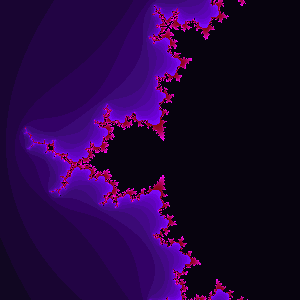

# Mandelbrot

This generates a mandelbrot fractal as a ppm image.

References
- <http://paulbourke.net/dataformats/ppm/>
- <https://en.wikipedia.org/wiki/Netpbm>
- <https://en.wikipedia.org/wiki/Mandelbrot_set>

## Build and run

```cargo
cargo run
```

## Dependencies

```toml
[dependencies]
num-complex = "0.4"
```

## Output


